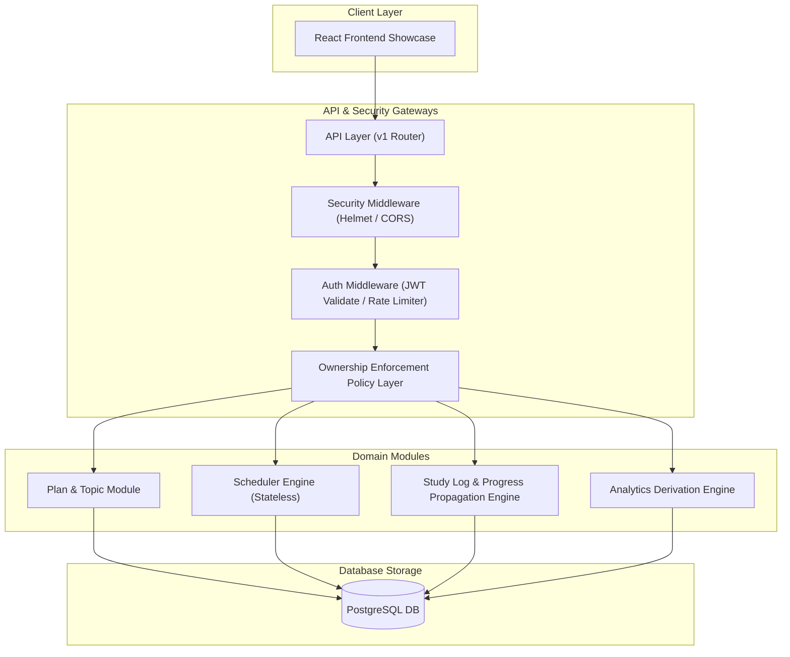
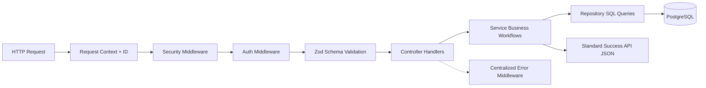
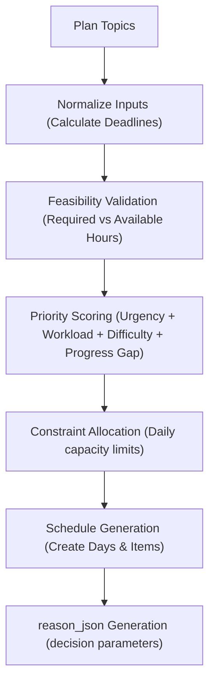
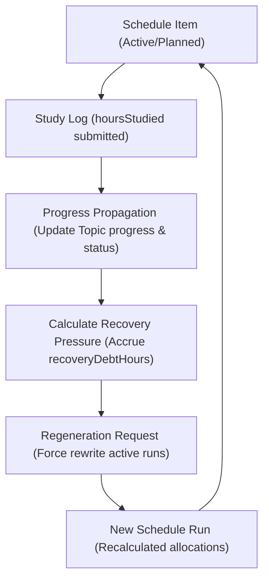
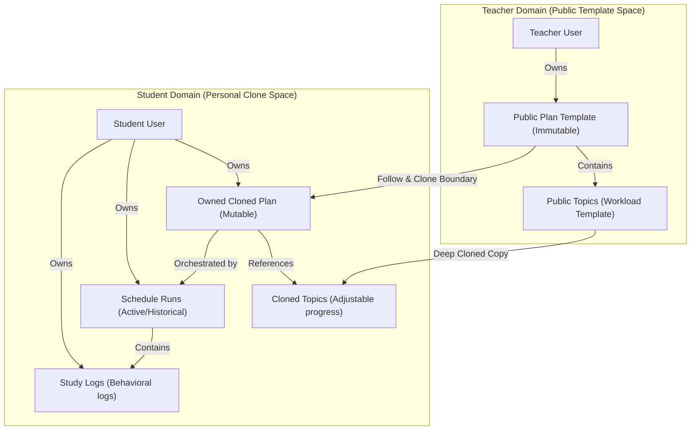

# StudyFlow System Architecture Document

This document details the high-level system shape, module boundaries, request pipelines, scheduler design, and execution mechanics of the StudyFlow platform. It emphasizes **why** decisions were made, rather than just **what** components exist.

---

## 🏛️ System Shape: Modular Monolith

StudyFlow is structured as a **modular monolith**. 

### Why this design?
A modular monolith keeps a single build/deployment package while enforcing strict boundary separation at the folder/package layer. This avoids network-hop latencies, complex distributed transaction handling, and deployment overheads associated with microservices, while still allowing the codebase to scale cleanly. If a single domain module (e.g., the Scheduler engine) requires high scaling in the future, its clean boundary separation makes it straightforward to extract into a dedicated microservice.

### Module Boundaries
The domain logic is partitioned into self-contained modules under `backend/src/modules/`:
- **`auth`:** Core identity, token sign/verify, revocable refresh tokens, and rate limits.
- **`plans`:** Plan template lifecycle, draft/published transitions, public catalogs, and follow-and-clone actions.
- **`topics`:** Study units and workload items contained inside plans.
- **`scheduler`:** Pure, stateless, deterministic scheduling algorithms.
- **`schedules`:** Scheduling execution runs, day partitions, and item allocations.
- **`studyLogs`:** Actual execution inputs, progress propagation, adherence scores, and recovery debt calculations.

---

## 🗺️ Diagram 1 — High-Level System Architecture

This diagram shows how requests flow down from the frontend interface through the secure API middleware stacks into segregated domain engines, culminating in safe database storage.

---

## 🔄 Request Lifecycle

Every HTTP request undergoes a standardized, pipeline-driven journey.

### Why Zod Validation is Centralized:
Requests are validated at the route gateway before executing any controller or service code. This guarantees that all functions downstream can trust that argument parameters (types, string formats, ranges) are 100% correct, preventing database corruption and boilerplate typechecking.

---

## ⚙️ Scheduler Architecture

The scheduler is a **pure, deterministic scheduling engine**. It takes study plan topics and capacity constraints as inputs and outputs an allocated daily study schedule.

### Why Deterministic Scheduling?
Heuristic or stochastic models (such as genetic algorithms or AI-driven scheduling) introduce non-deterministic execution paths. In an educational environment, a scheduler must be **debuggable**, **repeatable**, and **explainable**. If a student asks "Why was this topic scheduled today?", the system must trace it to clear scores (urgency, progress gap, difficulty), not to a randomized seed.

---

## 🗺️ Diagram 2 — Scheduler Pipeline Flow

This diagram illustrates how topics are validated, prioritized, filtered, and allocated into daily study slots, accompanied by the generated `reason_json`.

### Explainability Details (`reason_json`):
Each schedule item records metadata detailing:
- Urgency score (days until deadline)
- Workload pressure (hours left vs total hours)
- Difficulty weighting (difficulty tier 1-5)
- Clear decisions like `"Topic is overdue, prioritized for recovery"` or `"Light revision session scheduled"`.

---

## 🔁 Adaptive Execution Loop

StudyFlow adapts to student behavior. When a user submits a study log, the system propagates progress, recalculates risks, and determines if the current schedule run requires regeneration due to "Recovery Pressure".

---

## 🗺️ Diagram 3 — Adaptive Execution Loop

This diagram details the feedback loop where study outcomes affect plan progress, leading to recovery debt accumulation, and eventually triggering schedule regeneration.

### Why locks are held during log submission:
Log submissions utilize explicit database locking (locking the specific schedule item and its related topic) inside an ACID transaction to prevent concurrent updates from causing race conditions in progress calculations.

---

## 🛡️ Ownership Model

StudyFlow separates roles using Role-Based Access Control (RBAC) and row-level ownership validation policies.

- **RBAC:** Controls coarse API actions (e.g., only Teachers can create public templates).
- **Ownership Policies:** Controls fine-grained data mutations (e.g., a student can only edit plans, topics, and schedule runs they own).

---

## 🗺️ Diagram 4 — Plan Templates and Follow Boundaries

This diagram clearly shows the separation between public templates and personal student plans.

### Why we Clone Plans (Follow-and-Clone):
Sharing mutable schedule plans between students or linking directly back to a teacher's database row creates critical multi-tenant data leaks and write conflicts. Deep-cloning the plan and topics ensures total student isolation; each student's scheduler run can adapt independently based on their own study logs without mutating the original template.
