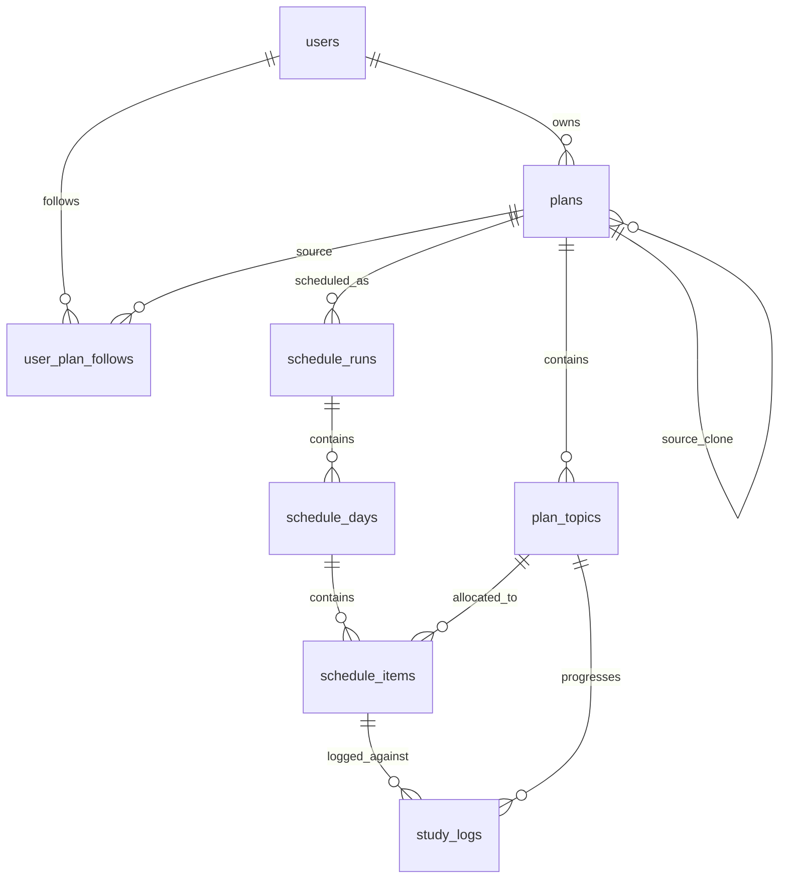

# StudyFlow Database Documentation

This document explains the schema design, entities, constraint boundaries, indexing strategies, and transactional invariants of the StudyFlow PostgreSQL database.

---

## 📊 Schema Entity Relationship Diagram



---

## 📂 Core Tables & Domain Invariants

### 1. `users`
Represents platform members.
- **Fields:** `id` (UUID), `name`, `email`, `password_hash`, `role` (enum: `student`, `teacher`, `admin`), `created_at`, `updated_at`.
- **Invariants:** `email` is unique and forced lowercase.

### 2. `plans`
Represents template or study plan details.
- **Fields:** `id` (BIGINT), `owner_id` (UUID, FK), `title`, `description`, `visibility` (enum: `private`, `public`), `status` (enum: `draft`, `published`, `archived`), `source_plan_id` (BIGINT, self-reference FK), `version` (INT), `created_at`, `updated_at`.
- **Invariants:** 
  - Public templates published by teachers are immutable. Any update triggers an assertion ensuring `status !== 'published' || visibility !== 'public'`.
  - A plan cannot link to itself as a source (`source_plan_id != id`).

### 3. `plan_topics`
Represents individual items of study workload.
- **Fields:** `id` (BIGINT), `plan_id` (BIGINT, FK), `name`, `normalized_name`, `difficulty` (INT), `estimated_hours` (DECIMAL), `deadline` (DATE), `progress` (DECIMAL), `status` (enum: `pending`, `in_progress`, `completed`), `position` (INT), `created_at`, `updated_at`.
- **Constraints & Invariants:**
  - `difficulty` must be between `1` and `5` (enforced via database CHECK constraint).
  - `progress` must be between `0.0` and `1.0` (enforced via database CHECK constraint).
  - `estimated_hours` must be positive.
  - `normalized_name` is generated automatically to prevent duplicate naming collisions inside a plan.

### 4. `schedule_runs`
Represents execution scheduler runs.
- **Fields:** `id` (BIGINT), `user_id` (UUID, FK), `plan_id` (BIGINT, FK), `status` (enum: `active`, `superseded`, `failed`), `feasibility_status` (enum: `feasible`, `impossible`, `revision_only`), `daily_capacity_hours` (DECIMAL), `generated_at`, `reason_json` (JSONB).
- **Critical Database Invariant:**
  - **Exactly one active schedule run per user-plan pair:** A unique partial index enforces this at the PostgreSQL layer:
    ```sql
    CREATE UNIQUE INDEX schedule_runs_one_active_per_user_plan_idx 
    ON schedule_runs(user_id, plan_id) 
    WHERE (status = 'active');
    ```
    This prevents application race conditions from spawning multiple active schedule tables.

### 5. `schedule_days`
Represents single days allocated inside a schedule run.
- **Fields:** `id` (BIGINT), `schedule_run_id` (BIGINT, FK), `date` (DATE), `total_planned_hours` (DECIMAL).

### 6. `schedule_items`
Represents planned slots on a specific date for a specific topic.
- **Fields:** `id` (BIGINT), `schedule_day_id` (BIGINT, FK), `topic_id` (BIGINT, FK), `allocated_hours` (DECIMAL), `priority_score` (DECIMAL), `status` (enum: `planned`, `active`, `completed`, `missed`, `recovered`), `reason_json` (JSONB).

### 7. `study_logs`
Stores the behavioral study records of actual work performed by a student.
- **Fields:** `id` (BIGINT), `user_id` (UUID, FK), `schedule_item_id` (BIGINT, FK, Unique), `topic_id` (BIGINT, FK), `hours_studied` (DECIMAL), `difficulty_feedback` (enum), `session_effectiveness` (enum), `perceived_workload` (enum), `logged_at`.
- **Critical Database Invariant:**
  - **One log per schedule item:** An item can only be completed once. Enforced by a unique database constraint on `schedule_item_id`.

---

## 🔒 Transactional Workflows & Isolation Levels

To ensure multi-tenant security and zero data corruption, two high-value operations run under strict PostgreSQL transaction blocks with explicit locking:

### 1. Follow-and-Clone Transaction
When a student clones a public teacher template, the system must create the new plan record, duplicate all template topics, and establish the user-follow link.
- **Process:**
  1. Acquire a `SHARE` lock on the source `plans` and `plan_topics` tables (`SELECT ... FOR SHARE`). This prevents the teacher from archiving or deleting the template mid-clone.
  2. Create a new `plans` record (`cloned_plan`) with `owner_id = student_id`.
  3. Bulk insert the cloned topics.
  4. Create the `user_plan_follows` record.
  5. Commit transaction. If any step fails (e.g., database constraint violation or duplicate follows), the SQL transaction rollback ensures no partial/orphaned plans are created.

### 2. Study Log Submission & Progress Propagation
Logs are the source of truth for scheduling adjustments. Submitting a study log triggers cascading updates to related tables.
- **Process:**
  1. Select the target `schedule_items` record using `FOR UPDATE` lock. This blocks other logs or regeneration requests from mutating the record simultaneously.
  2. Insert the `study_logs` row (violating the unique constraint causes immediate rollback if already logged).
  3. Propagate hours: sum total study logs for the topic and update `plan_topics.progress` and `plan_topics.status`.
  4. Update `schedule_items.status` to `completed`.
  5. Commit transaction.

---

## ⚡ Indexing Strategy

To keep the application highly responsive under load, the following database indexes are applied:

| Index Name | Table | Columns | Purpose |
|---|---|---|---|
| `schedule_runs_one_active_per_user_plan_idx` | `schedule_runs` | `user_id, plan_id` (Partial: `status = 'active'`) | Enforces a single active schedule run per plan for a user. |
| `schedule_runs_active_lookup_idx` | `schedule_runs` | `user_id, plan_id, status` | Optimizes active schedule retrieval on dashboard mount. |
| `schedule_days_run_date_idx` | `schedule_days` | `schedule_run_id, date` | Speeds up daily calendar fetches and timeline renders. |
| `schedule_items_day_priority_idx` | `schedule_items` | `schedule_day_id, priority_score DESC` | Delivers stable daily item sorting in the planner viewport. |
| `plan_topics_schedule_input_idx` | `plan_topics` | `plan_id, status, deadline` | Speeds up stateless scheduler fetches during execution runs. |
| `study_logs_user_topic_completed_idx` | `study_logs` | `user_id, topic_id` | Accelerates metric and progress aggregation queries. |
