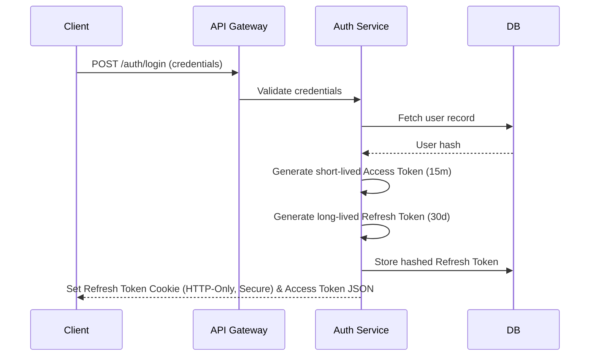

# StudyFlow Security & Access Policies

This document outlines the security architecture, token lifecycles, and authorization enforcement rules of the StudyFlow platform.

---

## 🔒 Authentication Flow & JWT Lifecycle

StudyFlow utilizes a stateless, token-based authentication mechanism using **JSON Web Tokens (JWT)** for secure request validation.



### 1. Token Properties
- **Access Tokens:** 
  - **Lifetime:** 15 minutes.
  - **Contents:** User ID (`sub`), Role (`role`), Type (`typ: "access"`).
  - **Purpose:** Carried in the HTTP header as a `Bearer` token to authenticate stateless API calls.
- **Refresh Tokens:**
  - **Lifetime:** 30 days.
  - **Contents:** Revocation ID, User ID.
  - **Purpose:** Exchanged via `POST /auth/refresh` to get a new access token, preventing user session timeouts.

### 2. Refresh Token Rotation & Replay Protection
To protect against token theft, StudyFlow implements **Refresh Token Rotation (RTR)**:
- Every time a refresh token is used to request a new access token, the old refresh token is **invalidated** and a new refresh token pair is issued.
- Refresh tokens are stored **hashed (SHA-256)** in the database to prevent compromises if the database is leaked.
- If a client attempts to reuse an expired/superseded refresh token, the authentication service flags this as a replay attack, immediately revokes **all** refresh tokens associated with that user, and forces a logout.

---

## 👤 RBAC vs. Row-Level Ownership Enforcement

Role-Based Access Control (RBAC) decides **what operations** a user class can trigger. Relationship-Based Ownership decides **what specific data rows** a user is allowed to touch.

```text
               ┌───────────────────────┐
               │    HTTP Request       │
               └───────────┬───────────┘
                           │
             1. RBAC (Broad Capabilities)
             "Can a Student publish plans?" -> No (Block)
             "Can a Teacher publish plans?" -> Yes (Pass)
                           │
                           ▼
             2. Ownership Policy Layer
             "Can Student X log hours on Student Y's schedule item?"
             -> Evaluated dynamically via DB relations -> Block / Pass
```

### 1. RBAC Strategy
Roles are broadly partitioned:
- **`student`:** Can create private plans, manage their own topics, execute schedules, and submit study logs.
- **`teacher`:** Can create public study plan templates, publish drafts, and view aggregated template utilization statistics.
- **`admin`:** Can audit all plans, override blocks, and retrieve system metrics.

### 2. Policy Enforcement Layer
Because students share the same database tables (like `plans` and `schedule_items`), RBAC alone cannot prevent Student A from accessing Student B's data.
StudyFlow uses a relationship-based policy layer (`backend/src/shared/policies/ownership.policy.js`) that is invoked by domain controller actions:

- **Plans Ownership:** Checks if `plan.ownerId === req.user.id`.
- **Topics Ownership:** Traverses the parent plan relationship to check if the student owns the plan containing the topic.
- **Schedule Items Ownership:** Traverses the multi-layer relation:
  `ScheduleItem -> ScheduleDay -> ScheduleRun -> userId`
  to verify that the active schedule item belongs to the authenticated requester.
- **Study Logs Ownership:** Verifies `studyLog.userId === req.user.id`.

### Why this boundary exists:
Bypassing these policies triggers a `403 Forbidden` (`OWNERSHIP_REQUIRED`) error. Enforcing this in the service layer (with database table joins) ensures that no user can sniff IDs or mutate another student's progress.

---

## 🛡️ Attack Prevention & Trust Boundaries

### 1. SQL Injection Prevention
Sequelize ORM is utilized for all query generation, parameterized statements, and values escaping, protecting the database from raw string manipulation exploits.

### 2. Rate Limiting
- **General Routes Limit:** 300 requests per 15-minute window.
- **Auth Routes Limit:** 20 register/login requests per 15-minute window (protects against dictionary/brute-force attacks).

### 3. Helmet Security Configuration
Secures Express applications by setting HTTP headers:
- Disables `X-Powered-By` header to hide runtime footprint.
- Restricts cross-site scripting (XSS) via `Content-Security-Policy`.
- Enforces secure transports via Strict-Transport-Security (HSTS).
- Prevents clickjacking using `X-Frame-Options` (DENY).
